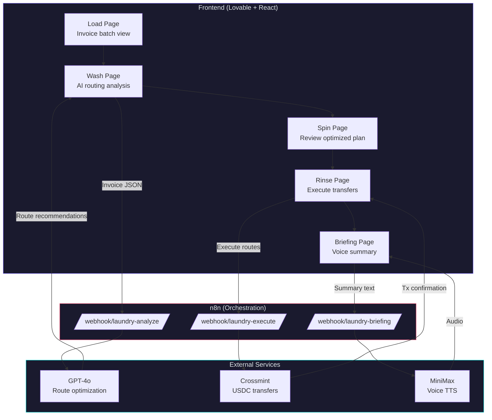

<div align="center">


# Laundry

**AI-powered cross-border treasury optimizer that eliminates unnecessary FX conversions using stablecoin routing.**

[](https://vitejs.dev)
[](https://react.dev)
[](https://typescriptlang.org)
[](https://n8n.io)
[](https://crossmint.com)
[](LICENSE)

> Companies lose 3–7% on every cross-border payment because money gets converted multiple times through banks and intermediaries. Laundry analyzes your entire payment batch, finds which conversions are unnecessary, and routes them through stablecoins — keeping transfers as close to 1:1 as possible.

[Getting Started](#-getting-started) · [How It Works](#-how-it-works) · [Architecture](#-architecture) · [Demo](#-demo)

</div>

---

## Table of Contents

- [The Problem](#the-problem)
- [The Solution](#the-solution)
- [How We're Different](#how-were-different)
- [Getting Started](#-getting-started)
- [Architecture](#-architecture)
- [How It Works](#-how-it-works)
- [Tech Stack](#-tech-stack)
- [Configuration](#-configuration)
- [Demo](#-demo)
- [With More Time](#with-more-time)
- [Team](#team)
- [License](#license)

---

## The Problem

Cross-border payments are broken. Not because the rails are slow — but because the conversions are wasteful.

When a company pays an international vendor, money typically passes through multiple banks, FX desks, and intermediaries. Each one adds a spread (0.5–5%) and a flat fee ($5–$75). On a batch of 5 invoices totaling $207,000, a company can lose **$7,600+** before a single dollar reaches the recipient.

The core issue isn't that transfers are expensive — it's that **value is lost repeatedly** during conversions and routing decisions that are made without optimization.

## The Solution

Laundry is an AI-driven treasury optimizer that minimizes FX losses by **reducing or eliminating unnecessary currency conversions**.

1. **Load** — Upload a batch of invoices or payment requests
2. **Wash** — AI examines the full set of payments, compares traditional bank routing costs against stablecoin routes
3. **Spin** — Review the optimized routing plan with per-invoice recommendations
4. **Rinse** — Execute real stablecoin transfers via Crossmint, with full transaction confirmation
5. **Brief** — AI-generated voice summary of your treasury optimization results

**Result:** A batch that would lose $7,600 through banks costs $2,070 through Laundry. **That's $5,530 saved — a 72% reduction in payment costs.**

## How We're Different

| | Traditional Banks | Fintech (Wise, Crebit) | **Laundry** |
|--|-------------------|------------------------|-------------|
| **Approach** | Fixed FX spreads + fees per transfer | Cheaper FX rates on individual transfers | AI optimizes the entire batch — eliminates conversions, not just cheapens them |
| **Unit of optimization** | Single payment | Single payment | **All payments together** |
| **Intelligence** | None | None | AI analyzes flows, recommends routing, executes |
| **Stablecoin usage** | None | Stablecoins as cheaper pipe | Stablecoins as conversion elimination — convert once, settle directly |
| **Target user** | Everyone | Consumers, students (B2C) | CFOs, treasury teams, companies (B2B) |

**The key insight:** Competitors make the pipe cheaper. We reduce how often you use the pipe.

---

## 🚀 Getting Started

```bash
# Clone the repo
git clone https://github.com/UJameel/Laundry.git
cd Laundry

# Install dependencies
npm install

# Set up environment variables
cp .env.example .env
# Edit .env with your API keys (see Configuration below)

# Start the dev server
npm run dev
```

Open [http://localhost:5173](http://localhost:5173) and you're in.

<details>
<summary><strong>Other commands</strong></summary>

```bash
npm run build        # Production build
npm run preview      # Preview production build
npm run test         # Run tests
npm run test:watch   # Watch mode
npm run lint         # Lint with ESLint
```

</details>

---

## 🏗 Architecture



---

## ⚙ How It Works

### Data Flow

1. **Load** — Dashboard loads pre-loaded invoice batch (5 invoices across 5 currencies)
2. **Wash** — Frontend calls `/webhook/laundry-analyze` with invoice JSON → GPT-4o analyzes the batch, compares traditional bank routes vs stablecoin routes → returns per-invoice recommendations with reasoning
3. **Spin** — User reviews the optimized routing plan: cost comparisons, savings per invoice, total batch savings
4. **Rinse** — User clicks Execute → frontend calls `/webhook/laundry-execute` → Crossmint transfers USDC on-chain → transaction confirmation returned
5. **Brief** — AI-generated voice summary via MiniMax TTS plays the treasury optimization report

### AI Routing Logic

The GPT-4o agent receives each invoice with:
- Amount in USD
- Target currency and country
- Traditional FX spread (1–6% depending on corridor)
- Traditional flat wire fee ($25–$75)

It compares this against the stablecoin route (1% on-ramp fee, near-zero transfer cost) and recommends the cheapest compliant path for each payment.

---

## 🛠 Tech Stack

| Layer | Technology | Purpose |
|-------|-----------|---------|
| **Frontend** | [Lovable](https://lovable.dev) + React + Vite + Tailwind | Treasury dashboard — invoice view, routing visualization, savings display |
| **Orchestration** | [n8n](https://n8n.io) | Backend workflow — connects AI analysis, payment execution, and voice generation |
| **AI** | GPT-4o (via n8n) | Routing intelligence — analyzes invoices, compares routes, recommends optimal path |
| **Payments** | [Crossmint](https://crossmint.com) | Stablecoin infrastructure — agent wallets, USDC on-ramp, transfers |
| **Voice** | [MiniMax](https://minimax.io) | Text-to-speech — AI-generated treasury briefings |
| **Deployment** | [Vercel](https://vercel.com) | Auto-deploys from GitHub on every push |

---

## 🔧 Configuration

<details>
<summary><strong>Environment variables</strong></summary>

Create a `.env` file in the project root (see `.env.example`):

```bash
# n8n Webhook URLs
VITE_N8N_OPTIMIZE_WEBHOOK=https://your-instance.app.n8n.cloud/webhook/laundry-analyze
VITE_N8N_EXECUTE_WEBHOOK=https://your-instance.app.n8n.cloud/webhook/laundry-execute
VITE_N8N_BRIEFING_WEBHOOK=https://your-instance.app.n8n.cloud/webhook/laundry-briefing

# Crossmint (staging)
CROSSMINT_API_KEY=sk_staging_...

# MiniMax
MINIMAX_API_KEY=...

# OpenAI (used by n8n AI Agent)
OPENAI_API_KEY=sk-proj-...

# Anthropic (optional — billing issues, using OpenAI instead)
ANTHROPIC_API_KEY=sk-ant-...
```

The `VITE_*` prefixed variables are used by the frontend. The rest are configured directly in n8n credential nodes.

</details>

<details>
<summary><strong>n8n Workflow setup</strong></summary>

The n8n workflow (ID: `3ZQ1rUxmixxFHyRD`) contains 3 webhook flows:

1. **Analyze** (`/webhook/laundry-analyze`) — Receives invoice batch → GPT-4o AI Agent with Structured Output Parser → Returns routing recommendations
2. **Execute** (`/webhook/laundry-execute`) — Receives optimized routes → Crossmint USDC Transfer HTTP Request → Returns transaction confirmation
3. **Briefing** (`/webhook/laundry-briefing`) — Receives summary text → MiniMax TTS HTTP Request → Returns audio data

Each flow uses the Webhook → Process → Respond to Webhook pattern.

**Required n8n credentials:**
- OpenAI API key (for the AI Agent node)
- Crossmint API key (as `X-API-KEY` header in HTTP Request)
- MiniMax API key (as `Authorization: Bearer` in HTTP Request)

</details>

---

## 🎯 Demo

**Sample scenario:** A US-based company has 5 pending international payments:

| Vendor | Country | Amount | Traditional Cost | Laundry Cost |
|--------|---------|--------|-----------------|-------------|
| Buenos Aires Design Co | Argentina | $12,000 | $645 (5%) | $120 (1%) |
| Berlin Tech GmbH | Germany | $45,000 | $1,375 (3%) | $450 (1%) |
| Lagos Logistics Ltd | Nigeria | $8,000 | $555 (6%) | $80 (1%) |
| London Creative Agency | UK | $92,000 | $1,865 (2%) | $920 (1%) |
| Tokyo Manufacturing | Japan | $50,000 | $1,530 (3%) | $500 (1%) |
| **Total** | | **$207,000** | **$5,970** | **$2,070** |

**Savings: ~$3,900 (65% reduction) — calculated by AI per batch**

> The AI analyzes each corridor independently, so actual savings vary by batch composition and FX conditions.

---

## With More Time

- **Flow netting** — Match incoming and outgoing payments in the same currency to eliminate conversions entirely
- **Live FX rates** — Real-time rate comparison across bank, fintech, and stablecoin routes
- **Off-ramp execution** — Convert USDC back to local currency as infrastructure expands
- **Invoice OCR** — Drop a PDF, AI extracts payment details automatically
- **Historical analytics** — "Last quarter you lost $142,000 to unnecessary FX conversions"
- **Multi-company treasury** — Optimize flows across subsidiaries of a multinational

---

## Team

| Name | GitHub | Role |
|------|--------|------|
| **Usman Jameel** | [@UJameel](https://github.com/UJameel) | Backend + AI orchestration (n8n, MiniMax) |
| **Sritej Bommaraju** | [@SritejBommaraju](https://github.com/SritejBommaraju) | Frontend + Design (Lovable, Figma) |
| **Taka Shirasu** | [@taka-shirasu](https://github.com/taka-shirasu) | Crossmint integration + Pitch + Animations |

---

## Built At

[**Vibe-Coding HACathon**](https://luma.com/oeacjgyz) — Building AI for Finance
Hosted by Hanwha AI Center (HAC) + AI Valley
April 3, 2026 | San Francisco, CA

---

## License

MIT

---

<div align="center">
<sub>Testnet only — we are not actually laundering anything.</sub>
</div>
